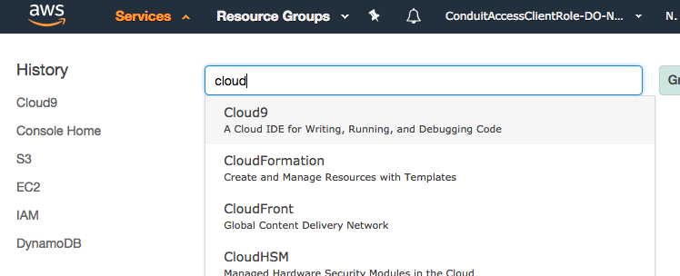
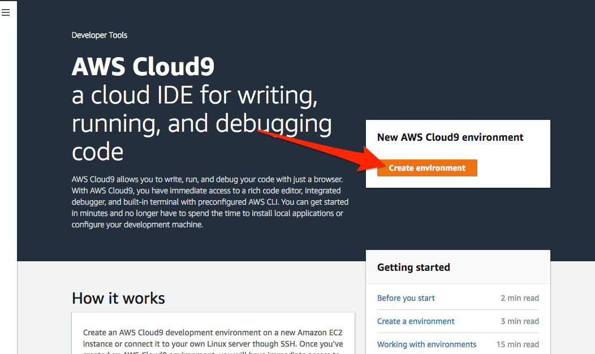
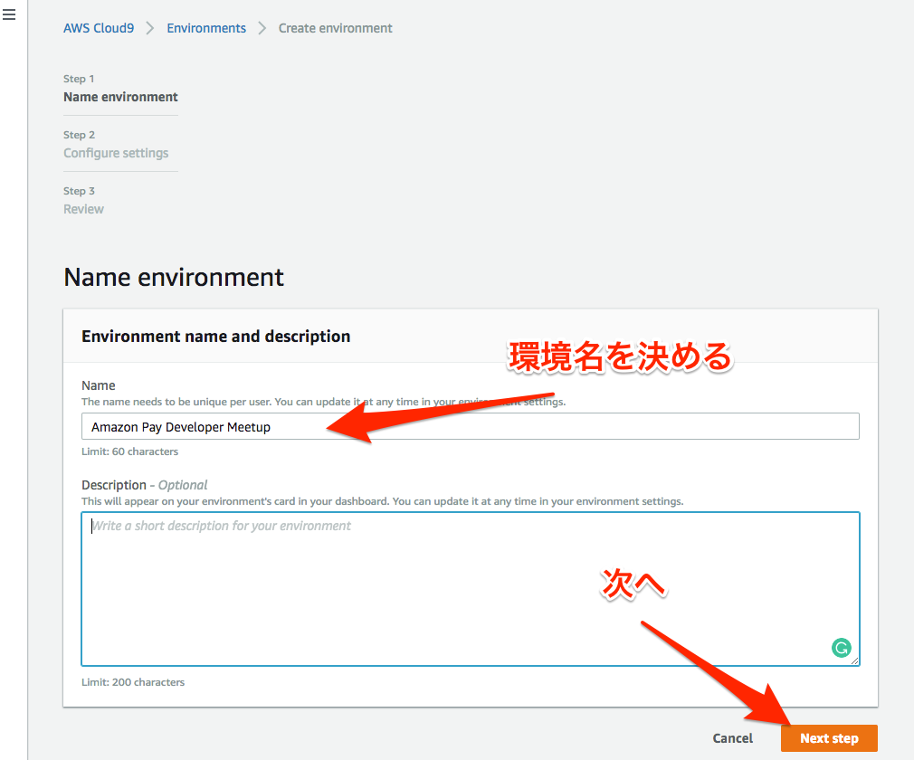
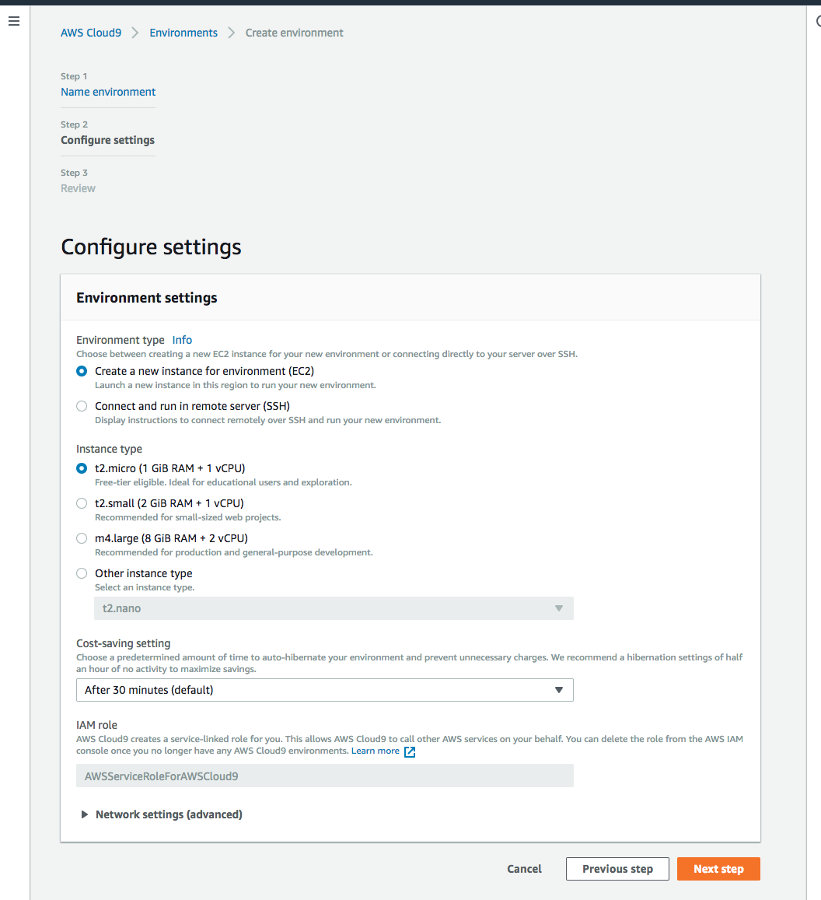
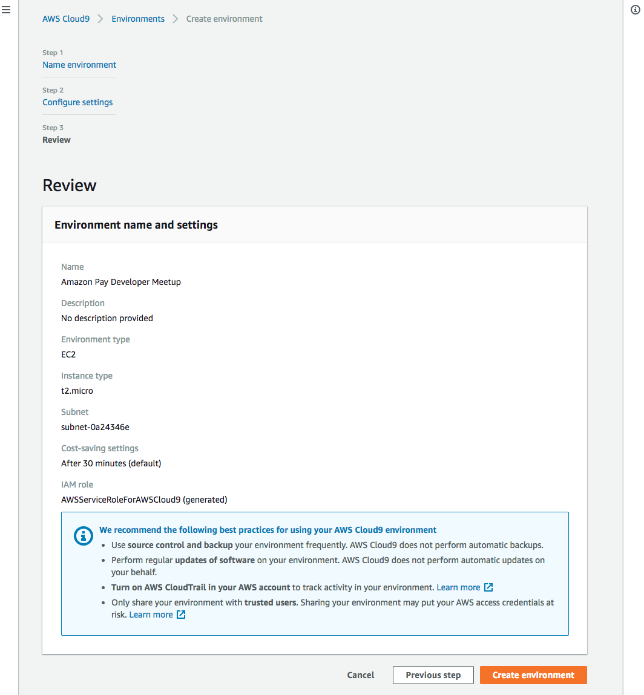
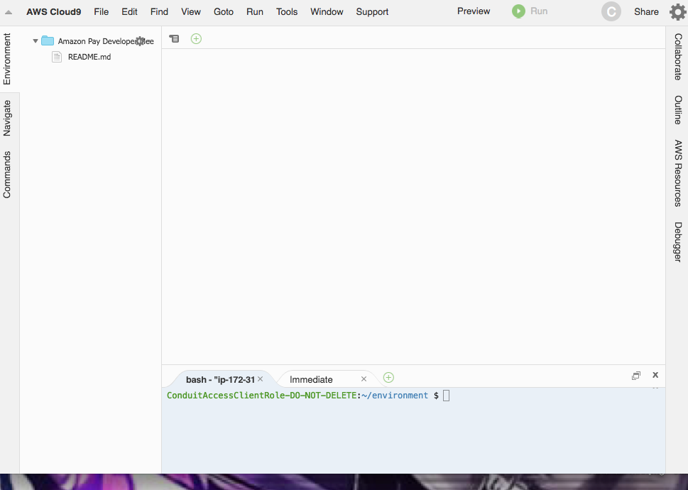
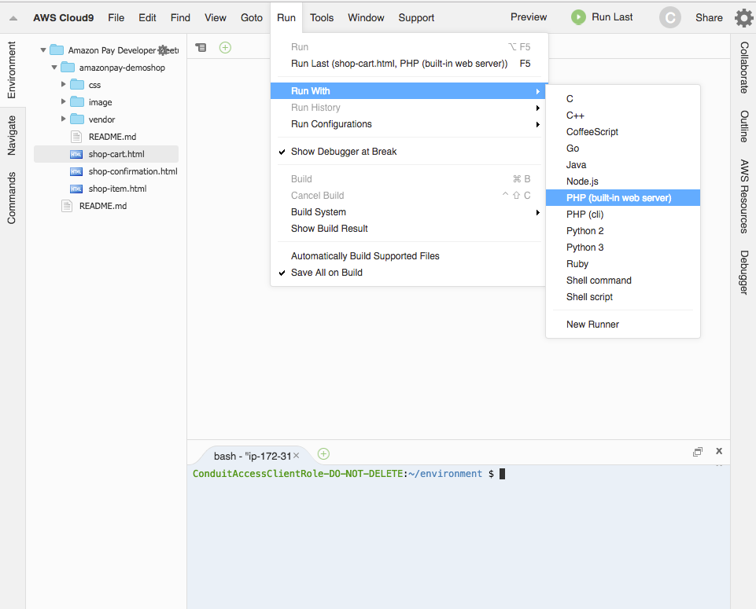
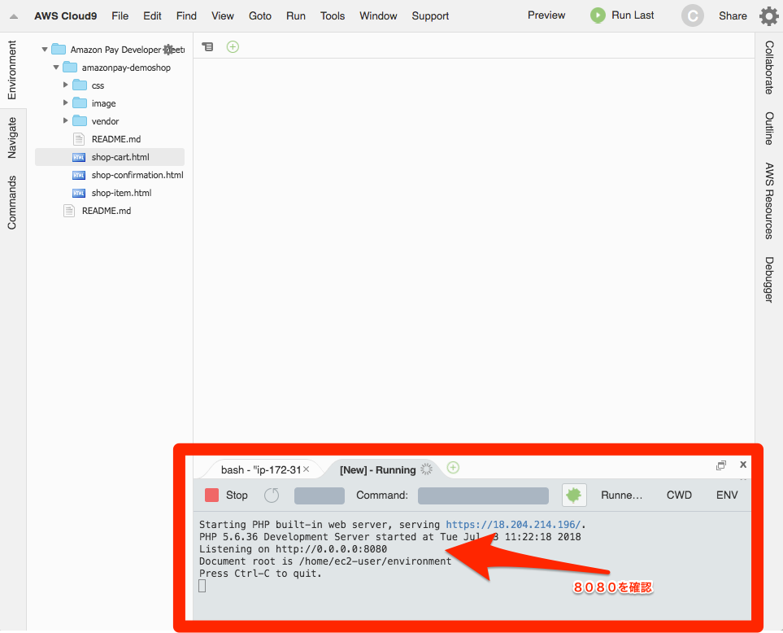
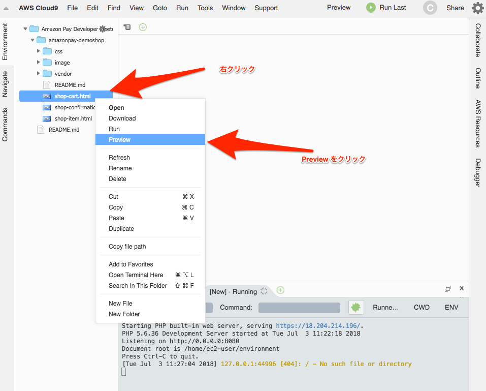
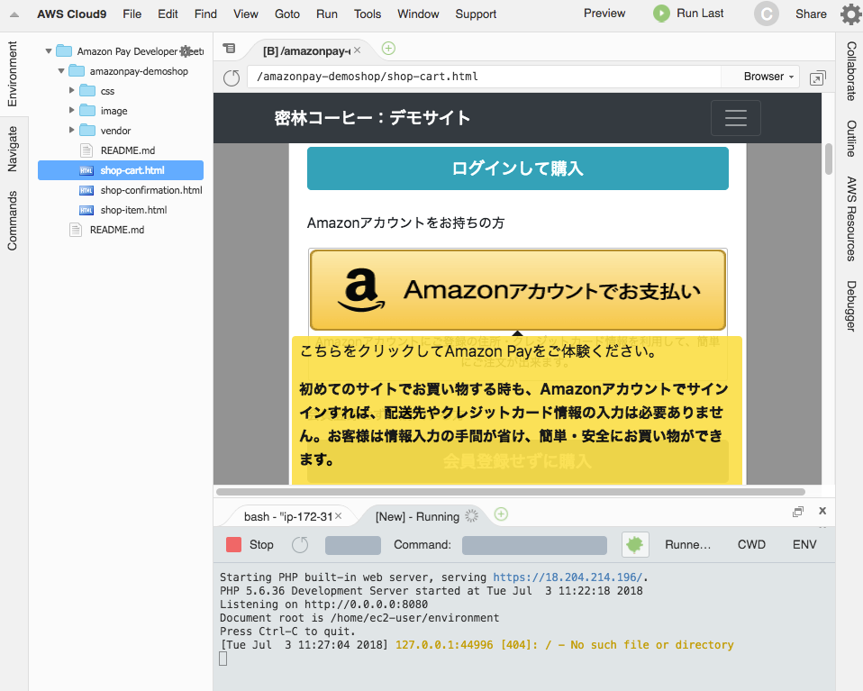

# Amazon Pay Developer Meetup #3 90分ハンズオン＆達人度試験

この、でもショップは二つの環境で動かせるように解説していきます。

[AWS Cloud9 で環境構築をしよう](#AWS Cloud9 で環境構築をしよう)

[PHP Buil-in server を使ってデモショップを動かそう]

PHP Buil-in server を使ってデモショップを動かそう。

# AWS Cloud9 で環境構築をしよう

#### 1. AWS にアカウントにログインして, サービスのメニューからCloud9を選択

#### 2. Create evironment を選択して、新しく環境を作成を開始します。

#### 3. 環境名前を入力して、Next Stepをクリック

#### 4. 開発サーバーの構成選択

デフォルトで問題はありません。EC2が一つ立ち上がりますので、こちらのEC2で開発していく形になります。

#### 5. 構成の確認

最後に内容を確認して、問題がなければ Create environmentをクリック

#### 6. しばらくすれば、Cloud9が立ち上がります

# PHP Buil-in server を使ってデモショップを動かそう。

# Cloud9上デモショップを動かしてみよう。

#### 1. Run メニュから Run with の中に、PHP (built-in web server)を選択します。

#### 2. built-in web serverが8080で動いているかをcheck

#### 3. 最後に web browser でデモショップを開く

右のファイル一覧から、shop-cart.htmlを選んで右クリックして　Previewをクリック

#### 4. 以下のページが現れたら成功です。

